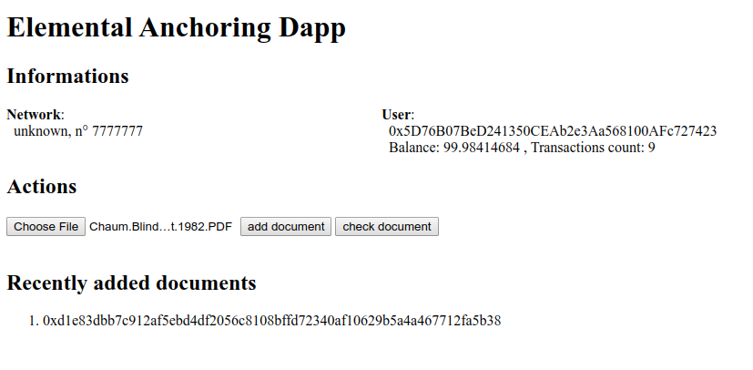

# Elemental Anchoring Dapp

Simple document register in solidity with a web interface.

This aims to be a boilerplate for educational purposes. It offers a full example of a decentralised application. Comments, issues and PR are welcome. 

## Technologies
- **Waffle**, a testing tooling. We use it for compilation and testing.
- **Ethers**, a library for interacting with an ethereum node.
- **Vuejs**, a JavaScript framework
- **live-server**, a simple node server

## Installation
It currently assumes that a **local node** is available at localhost:8545. You can use ganache-cli, a node in unsafe and unlocked mode, or ganache, in which case you must change the port in settings to 8545. Port could also be modified in deploy.js.

If you use [Metamask](https://metamask.io), you must switch network to localhost 8545.

Install dependencies

  `npm install`

## Use

To compile, deploy and launch, simply use:

  `npm start`

It should open a browser at http://127.0.0.1:8080/

Additional commands:
- Compile `npm run compile`
- Deploy `npm run deploy`
- Launch dev server `npm run serve`
- Run tests `npm run test`
- Generate documentation `npx solidity-docgen`